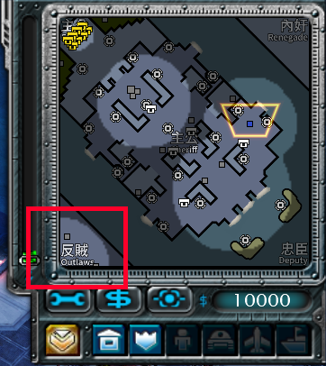

# 《紅色警戒3》三國殺遊戲教程

這是一個《紅色警戒3》的新遊戲模式名為「三國殺」，它允許五位玩家（最好是人類）遊玩。在這個模式中，玩家需要扮演不同角色並且完成不同目標來取得勝利。

## 語言

[English](../README.md) | [简体中文](README.chs.md) | 繁體中文

## 怎麼玩

### 在遊戲前

遊戲由五人進行。每位玩家隨機地取得以下身份之一：

- 主公 x 1, 
- 忠臣 x 1, 
- 反賊 x 2, 
- 內奸 x 1. 

主公總是在地圖最中心。其他玩家的位置是隨機分配的。

四種身份被印在雷達的四角。如果你取得了一種身份，在對應的角落附近的地圖會被揭示。只有你可以看到你的身份揭示。比如說，在圖1，左下角的地圖被揭示了，這說明我在遊戲中扮演反賊。



### 在遊戲中

在地圖上有幾處永久的揭示，它們幫助你搞清楚戰場上的局勢。

當一名玩家被殺死，廣播會通告所有玩家一名對應身份的玩家被擊殺，並且與他的身份對應的地圖角落會被永久揭示。比如說，在圖2，忠臣被殺死了，廣播通知了他的死訊，忠臣的地圖角落被揭示了。


### 遊戲結束

對不同身份而言，遊戲的目標是不同的：

- 反賊必須殺死主公；
- 主公和忠臣必須殺死反賊和內奸；
- 內奸必須殺死所有角色，主公是最後一個被殺死的。

這裡有一個目標更清晰的版本：

```
if Sheriff is dead and more than or equal to 1 Outlaws is alive:
	Outlaws win
else if Outlaws are dead and Renegate is dead:
	Sheriff and Deputy win
else if Outlaws are dead and Renegate is dead and Sheriff is dead:
	Renegade wins
else if Sheriff is dead and more than or equal to 1 Deputy is alive:
	nobody wins
```

__注意：如果有人退出遊戲，他將被視為被殺死。 例如，如果忠臣和内奸還活着並且主公退出，反贼將贏得比賽。在真正被殺死之前退出遊戲是不良行為。__

__注意：如果内奸杀死了反贼、主公，但是留下了忠臣还活着，内奸没有获胜。__


如果任何一位或一組玩家完成了他，她或他們的目標，他，她或他們將勝利，並且其他玩家將失敗。比如說，在圖3，反賊殺死了主公，反賊們勝利了。


## 衍生品規則

每個人都可以 __遵循以下規則時__ 自由修改此存儲庫中的地圖并分發修改後的衍生作品：

- 提醒其他人該地圖不是原始版本。

- 讓其他人知道誰修改了這張地圖以及如何與您聯繫。

- 不要使用與其他衍生品相同的名稱。（您可以在地圖名稱上添加您自己的名字。）
